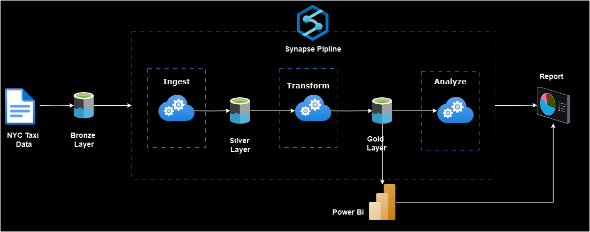

### Introduction
* Learn how to build a real world project using `Azure Synapse Analytics` to process data from NYC Taxi Trips data
* Learn how to create SQL scripts and Spark notebooks in Azure Synapse Analytics
* Acquire professional level data engineering skills in Azure Synapse Analytics.

### Project Overview

##### 1. Data Discovery
- Data exploration capability on the raw data
- Schema applied to the raw data
- Discovery using T-SQL
- Discovery using pay-per-query model

##### 2. Data Ingestion
- Ingested data to be stored as Parquet files
- Ingested data to be stored as tables/ views
- Ability to query the ingested data using SQl
- Ingestion using pay-per-query model

##### 3. Data Transformation
- Join the key information required for reporting to create a new table
- Join the key information required for Analysis to create a new table
- Must be able to analyze the transformed data via T-SQL
- Transformed data must be stored in columnar format

##### 4. Reporting Requirements
- Campaign to ecourage creadit card payments
    - Trips made using credit card/ cash payments
    - Payment behaviour during days of the week/ weekend
    - Payment behaviour between boroughs
- Identify taxi demand
  - Demand based on borough
  - Demand based on day of the week/ weekend
  - Demand based on trip type (i.e., Street hail)
  - Trip distance, trip duration, total fare amount etc per day/ borough

**This cource refer from Udemy course [Click here](https://www.udemy.com/course/azure-synapse-analytics-for-data-engineers/?couponCode=SKILLS4SALEB) for more detai**